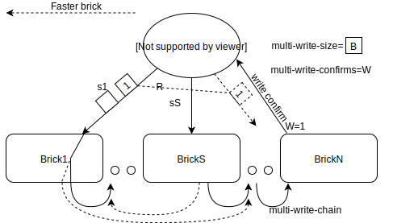

Looking to enhance small/medium file write performance with smart write

### **multi-write=_S_** option:
**multi-write-confirms=_W_** (default 1)

N replicated volume system needs N replicas to be written it:

- splits writes in to **_S_** sections/sequences/queues s1 (s2 s3) .. sS and write them to (fastest) S number of bricks separately in **parallel** (files on the fly are divided in to S sections-sequences of blocks of size **_B_**)
- when brick receives block from sX it starts writing received block to other bricks directly (like heal does), eventually building full replica on each of N nodes.
- the brick that received block sX, after successful copy of the block to at least **_W_** nodes returns write successful to client.
- combining write successful of blocks client checks if full file is written and returns write done after all specific file blocks reported written by bricks;
- number of small files can fit in one block (similar to aggregate writes). **multi-write-size**=128KB (**_B_**) changeable value.
- for the purpose of achieving W brick counts itself too. 
- W and S should not be larger then N.

If S=N then client writes N parts-sequences of the file to all N nodes.
If S=1 then client writes everything to one brick.
If S-0 - disabled

- In combination with W=1 client doesn't wait for reply from brick after writing first block and marks file as written:
 -- With S=1 it leaves replication of files to back-end completely;
 -- With S=N it makes back-end assemble the puzzle by itself in a background.

With W=2 failure of one node while writing is tolerable. Node failure tolerance is W-1



Later additional fail safe can be made by adding duplication writes:
### **multi-write-redundancy**=R (default 1)
- saves each block from the client with multi-write to R bricks at the same time (creating S*R write torrents writing same sx R times),
- telling the brick its replica duty brick numbers (to which bricks each block has to be forwarded after received from client), dividing replication duty among bricks on the fly when next brick is ready for next block.
- 1<R<(S+1)/2 round-up, otherwise it makes no sense easier to disable: 4(N) bricks with 2(S) sequences each 2(R) redundant will be wrighting to all 4 bricks already, if redundancy is 3 it will have to write both sequences to the same brick, defying the purpose of multi-write of making bricks populate data to each other.
- W in this case counts as W/R round-up: if brick is receiving one of R extra blocks it means that another brick(s) is also receiving it (2 sequences 2 redundant with 2 confirms will need just 1 confirm - itself right away)
- with odd S distribution goes ladder otherwise checkerboard:

(assumption is that Brick1 is fastest or local etc.)
For 3 replica with S=3 (3 torrents to bricks) R=2 (double redundancy) W=3 (confirm all replicas, W is treated as 2 so each brick need one successful write duty). **bX- is brick replica duty.** 
- Brick1 has a duty to replicate block received from Sequence1(s1) to Brick2(b2)
- Brick1 connection to Brick2 is faster then connection from Brick3 to Brick2 otherwise Brick3 will get s1 replication duty
```
Brick1 Brick2 Brick3 
s1(b2)        s1
s2(b3) s2
       s3(b1) s3
```
For 4 replica with S=4 R=2 with W=4
(W is treated as 2 - each brick need to report itself + one completed write)
```
Brick1 Brick2 Brick3 Brick4 
s1 (b2)       s1(b4)
s2 (b2)       s2(b4) 
       s3 (b1)       s3(b3)
       s4 (b1)       s4(b3)

```

For 7 replica with S=7 R=2 with W=7 (W is treated as 4 - each brick need to report up to 4 writes including itself)
```
Brick1  Brick2  Brick3  Brick4  Brick5  Brick6  Brick7
s1(b234)                                        s1(b56)
s2(b345)s2(b67) 
        s3(b145)s3(b67)
                s4(b125)s4(b67)
                        s5(b123)s5(b67)
                                s6(b123)s6(b47)
                                        s7(b123)s7(b45)

```
For 7 replica with S=3 R=2 with W=5 (W is treated as 3 - each brick need to report itself + 2 completed writes) (**example A7**)
```
Brick1  Brick2  Brick3  Brick4  Brick5  Brick6  Brick7
s1(b245)        s1(b67)
s2(b345)s2(b67) 
        s3(b145)s3(b67)
```

### add 11/10/2018
### multi-write-chain=on by default

With non ssd rdma setups it will clearly be faster if Bricks delegate replication further down the chain.
- **O** - chain oreginating brick;
- **Y** - full chain calculated depending on interbrick speeds;
- brick receives sX(bY)W**O** it sends it **only** to the next brick as sX(bY - current brick), for example(A7) Brick2 receives write from the Client as s1(b145)(2)(2) it sends it to next Brick1 as s1(b45)(1)(2), Brick1 - sends it to Brick4 as s1(b5) and sends write confirmation, Brick4 sends s1 to Brick5. Each hop W is lowered by one. When BrickX receives W=1 it reports write complete to Brick**O**, which in turn reports it to the client (or maybe directly to the client from W=1 brick);
- easy way to define and deduct current Brick from dY is to use Y as binary with 1 for brick duty active. b145 will become 11001, defining duty as 25 or 19HEX, When Brick 1 receives it it becomes 11000 (24 or 18HEX);
- this should be default behavior for multi-write, though star distribution versus chain might yeld better results with low latency environments like ssd with rdma.

### multi-write-map=M 
**Mount option**. By default 0 - disabled
There is high possibility that administrator knows something that will be hard or resource costly to find out programaticaly regarding latency and queuing for writing data. Administrator should be able to define static priority map for each mount
- M=Pn...P0 for example (A7) 58001, P is priority of Brick(n), 0 or missing is undefined, 1 is lowest, F (HEX) is highest. 58001 Means that Brick0 has lowest priority 1, Brick3 is 8, Brick4 is 4, Bricks1,2,5,6 are not defined.
- Not defined has higher priority then 1;
- Not defined bricks are selected using regular ping algorithm;
- No matter what, if bricks are up write goes first to Bricks with defined priority >1, then to undefined, and lastly to bricks with Priority 1;
- this can be adapted for reads as well (though priority Brick can be selected with xlator mount options or select-local such approach might provide better flexibility);

